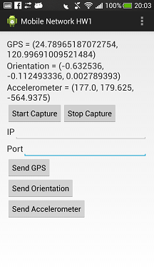

Mobile Network Homework 1
=========================

- Develop by Eclipse.
- Android version: 4.2 (API Level 17).
- Also compatible with 4.1. But I didn't test other versions.

Functions
---------

- Capture GPS info.
- Capture Orientation.
- Capture Accelerometer.
- Send info to server (You need a socket echo server).

Known Bugs
----------

- If the IP and Port info is wrong, the APP will crash.

